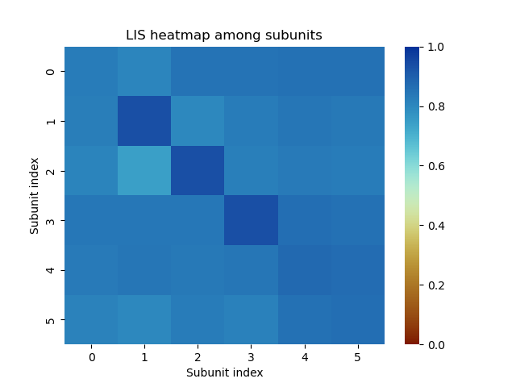
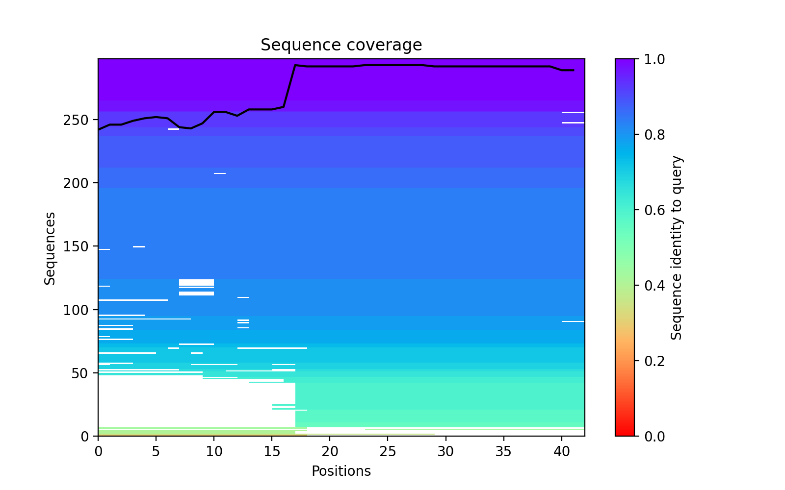
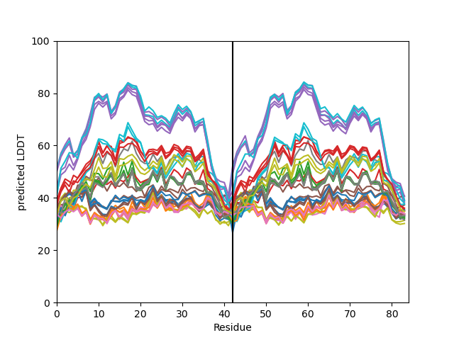
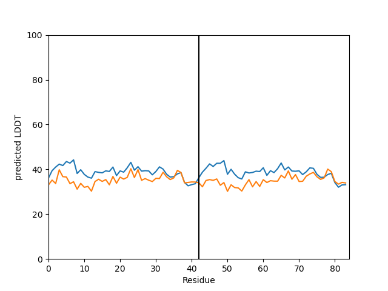
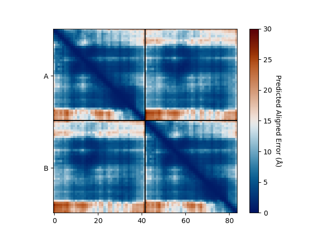

Importing Alphafold Data
========================

Supported formats
-----------------

The ``af2_analysis`` package supports the following file formats for input data:

- Alphafold 2 [#AF2]_ and 3 [#AF3]_ 
- ColabFold [#ColabFold]_
- AlphaPulldown [#AlphaPulldown]_

Importing procedure
-------------------

Create the ``Data`` object, giving the path of the directory containing the results of the AlphaFold or ColabFold run. 

.. code-block:: python

    import af2_analysis
    my_data = af2_analysis.Data('MY_AF2_RESULTS_DIR')

Extracted data are available in the ``df`` attribute of the ``Data`` object as a ``pandas`` dataframe. 

.. code-block:: python

    my_data.df

Merge ``Data`` objects
----------------------

You can merge multiple ``Data`` objects into a single object using the ``concat_data()`` function.

.. code-block:: python

    my_data1 = af2_analysis.Data('MY_AF2_RESULTS_DIR1')
    my_data2 = af2_analysis.Data('MY_AF2_RESULTS_DIR2')
    my_data = af2_analysis.concat_data([my_data1, my_data2])

Scores
======

pDockq
------

pDockQ (Predicted DockQ) [#pdockq]_ is a metric that predicts the quality of protein-protein interactions in dimer models.  It uses a sigmoid function that considers the number of contacts in the interface (:math:`log(number \: of \: interface \: contacts)`) and the average pLDDT (predicted lDDT score) of the interface residues (:math:`\overline{plDDT_{interface}}`).

Implementation was inspired from `https://gitlab.com/ElofssonLab/FoldDock/-/blob/main/src/pdockq.py <https://gitlab.com/ElofssonLab/FoldDock/-/blob/main/src/pdockq.py>`_.

The ``pdockq()`` function calculates the pDockq [#pdockq]_ score for each model in the dataframe. The pDockq score ranges from 0 to 1, with higher scores indicating better model quality.

.. math::
    pDockQ = \frac{L}{1 + e^{-k (x-x_{0})}} + b

where: 

.. math::
    x = \overline{plDDT_{interface}} \cdot log(number \: of \: interface \: contacts)

:math:`L = 0.724` is the maximum value of the sigmoid,
:math:`k = 0.052` is the slope of the sigmoid, :math:`x_{0} = 152.611`
is the midpoint of the sigmoid, and :math:`b = 0.018` is the y-intercept
of the sigmoid.

.. code-block:: python

    from af2_analysis import analysis
    analysis.pdockq(my_data)

For the *multiple* pDockQ or `mpDockQ` [#mpdockq]_ this values are used:
:math:`L = 0.728`, :math:`x0 = 309.375`, :math:`k = 0.098` and :math:`b = 0.262`.

.. code-block:: python

    from af2_analysis import analysis
    analysis.mpdockq(my_data)

pDockq2
-------

pDockQ2, or Predicted DockQ version 2 [#pdockq2]_, is a metric used to estimate the quality of individual interfaces in multimeric protein complex models. Unlike the original pDockQ, pDockQ2 incorporates AlphaFold-Multimer's Predicted Aligned Error (PAE) in its calculation, making it more sensitive to large, incorrect interfaces that might have high confidence scores based solely on interface size and pLDDT. pDockQ2 scores range from 0 to 1, with higher scores indicating better interface quality.

.. math::
    pDockQ_2 = \frac{L}{1 + exp [-k*(X_i-X_0)]} + b

with

.. math::
    X_i = \langle \frac{1}{1+(\frac{PAE_{int}}{d_0})^2} \rangle * \langle pLDDT \rangle_{int}

:math:`L = 1.31` is the maximum value of the sigmoid, :math:`k = 0.075` is the slope of the sigmoid, :math:`x_{0} = 84.733`
is the midpoint of the sigmoid, and :math:`b = 0.005` is the y-intercept of the sigmoid.

Implementation was inspired from `https://gitlab.com/ElofssonLab/afm-benchmark/-/blob/main/src/pdockq2.py <https://gitlab.com/ElofssonLab/afm-benchmark/-/blob/main/src/pdockq2.py>`_.

.. code-block:: python

    from af2_analysis import analysis
    analysis.pdockq2(my_data)

LIS Score
---------

The Local Interaction Score (LIS) [#LIS]_ is a metric specifically designed to predict the likelihood of direct protein-protein interactions (PPIs) using output data from AlphaFold-Multimer [#AF2M].
Unlike metrics like interface pTM (ipTM), which measures the overall structural accuracy of a predicted complex, LIS focuses on areas within the predicted interface that have low Predicted Aligned Error (PAE) values. These low PAE values, often visualized as blue regions in AlphaFold output maps, represent areas of high confidence in the interaction prediction

Here's how LIS is calculated:

* Local Interaction Areas (LIAs) are identified: Regions of the predicted interface with PAE values below a defined cutoff (typically 12 Å) are designated as LIAs.
* PAE values within LIAs are inverted and averaged:  PAE values within LIAs are transformed to a 0-1 scale, with higher numbers indicating stronger interaction likelihood. These values are then averaged across the interface to produce the LIS score.
* The LIS method is particularly adept at detecting PPIs characterized by localized and flexible interactions, which may be missed by ipTM-based evaluations. This is particularly relevant for interactions involving intrinsically disordered regions (IDRs), which are often missed by structure-based metrics.

.. image:: _static/figure_LIS.png
  :width: 600
  :alt: LIS Score

Figure from ``github.com/flyark/AFM-LIS``. Implementation was inspired from `https://github.com/flyark/AFM-LIS <https://github.com/flyark/AFM-LIS>`_.

- to compute the LIS matrix among subunits:

.. code-block:: python

    from af2_analysis import analysis
    import seaborn as sns
    from cmcrameri import cm
    
    # Extract LIS heatmap among subunits
    analysis.LIS_matrix(my_data, pae_cutoff=12.0)
    
    # Plot the heatmap
    ax = sns.heatmap(my_data.df.LIS.iloc[0], cmap=cm.roma)
    ax.collections[0].set_clim(0,1)  # Set the heatmap range
    ax.set_title('LIS heatmap among subunits')
    ax.set_xlabel('Subunit index')
    ax.set_ylabel('Subunit index')

Example of LIS heatmap among subunits on a protein-DNA-Zn complex computed with AlphaFold 3.

Plots
=====

MSA Plot
--------

The ``plot_msa()`` function generates a multiple sequence alignment (MSA) plot for the predicted models. The MSA plot shows the sequence conservation of the predicted models, highlighting regions of high and low conservation.

.. code-block:: python

    my_data.plot_msa()

pLDDT Plot
----------

The ``plot_plddt()`` function generates a pLDDT plot for the predicted models. The pLDDT plot shows the per-residue local distance difference test (pLDDT) score for each residue in the predicted models, highlighting regions of high and low model confidence.

* you can plot all models plddt at once:

.. code-block:: python

    my_data.plot_plddt()

* or you can plot specific models plddt:

.. code-block:: python

    my_data.plot_plddt([0,1])

PAE Plot
--------

The ``plot_pae()`` function generates a predicted aligned error (PAE) plot for the predicted models. The PAE plot shows the per-residue predicted aligned error for each residue in the predicted models, highlighting regions of high and low model accuracy.

.. code-block:: python

    best_model_index = my_data.df['ranking_confidence'].idxmax()
    my_data.plot_pae(best_model_index)

3D Structure Visualization
==========================

The ``show_3d()`` function displays the 3D structure of the predicted models using the ``nglview`` package. The 3D structure visualization allows users to interactively explore the predicted models and compare them with the experimental structure.

.. code-block:: python
    
    my_data.show_3d(my_data.df['ranking_confidence'].idxmax())

.. raw:: html

    <iframe src="_static/dimer.html" style="width:100%;height:300px"></iframe>

Clustering
==========

This approach aims to address the challenge of managing and analyzing the
large number of models (*e.g.*, 10.000) produced for each protein complex,
especially since these models often exhibit structural redundancies.

To do so, the user can use the ``clustering`` module to cluster the models
based on their structural similarity. The user can choose:

* a selection to align model structures, *e.g.* ``"backbone and chain A"``
* a selection to calculate the RMSD matrices, *e.g.* , ``"backbone and chain B"``,
* a threshold value to determine the number of clusters.
* RMSD can be scaled using Björn Wallner method:

.. math::
    RMS_{scaled} (RMS, di) = \frac{1}{1 + (\frac{RMS}{di})^2}

with RMS: RMSD matrix, di: scaling factor of 8.5 Å. 

From the distance matrix (scaled or not), we performed an ascending hierarchical
classification to determine the clusters based on the distance threshold.

.. code-block:: python

    from af2_analysis import clustering

    clustering.hierarchical(my_data.df, threshold=0.3)
    clustering.compute_pc(my_data.df)
    clustering.plot_pc(my_data.df)

References
==========

.. [#AF2] `Jumper et al. Nature (2021) doi: 10.1038/s41586-021-03819-2 <https://www.nature.com/articles/s41586-021-03819-2>`_
.. [#AF3] `Abramson et al. Nature (2024) doi: 10.1038/s41586-024-07487-w <https://www.nature.com/articles/s41586-024-07487-w>`_
.. [#ColabFold] `Mirdita et al. Nat Methods (2022) doi: 10.1038/s41592-022-01488-1 <https://www.nature.com/articles/s41592-022-01488-1>`_
.. [#AlphaPulldown] `Yu et al. Bioinformatics (2023) doi: 10.1093/bioinformatics/btac749 <https://doi.org/10.1093/bioinformatics/btac749>`_
.. [#pdockq] `Bryant et al. Nat Commun (2022) doi: 10.1038/s41467-022-28865-w <https://www.nature.com/articles/s41467-022-28865-w>`_
.. [#mpdockq] `Bryant et al. Nat Commun (2022) doi: 10.1038/s41467-022-33729-4 <https://www.nature.com/articles/s41467-022-33729-4>`_
.. [#pdockq2] `Zhu et al. Bioinformatics (2023) doi: 10.1093/bioinformatics/btad424 <https://academic.oup.com/bioinformatics/article/39/7/btad424/7219714>`_
.. [#LIS] `Kim et al. bioRxiv (2024) doi: 10.1101/2024.02.19.580970 <https://www.biorxiv.org/content/10.1101/2024.02.19.580970v1>`_
.. [#AF2M] `Evans et al. bioRxiv (2021) doi: 10.1101/2021.10.04.463034 <https://www.biorxiv.org/content/10.1101/2021.10.04.463034v2>`_
